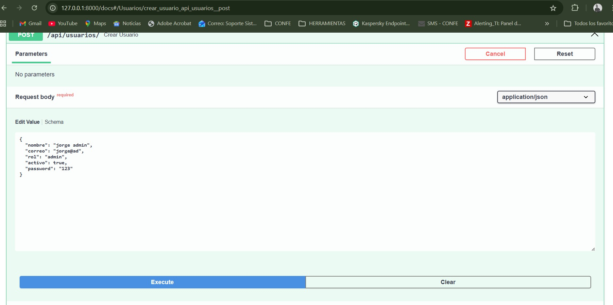
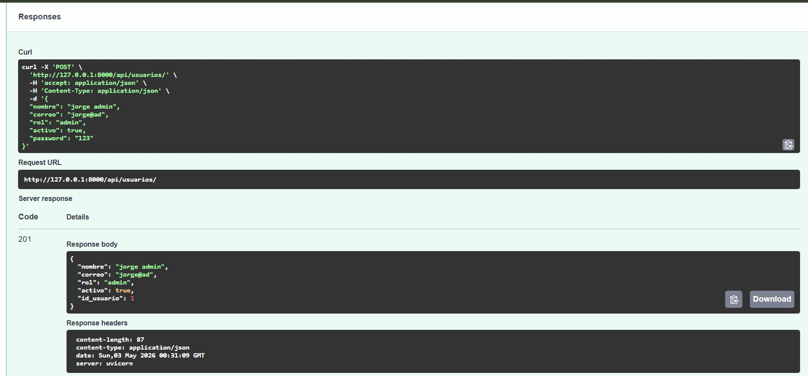
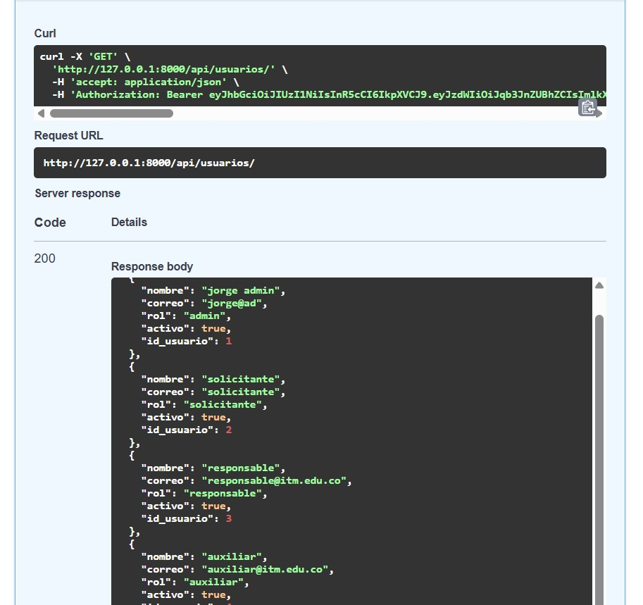
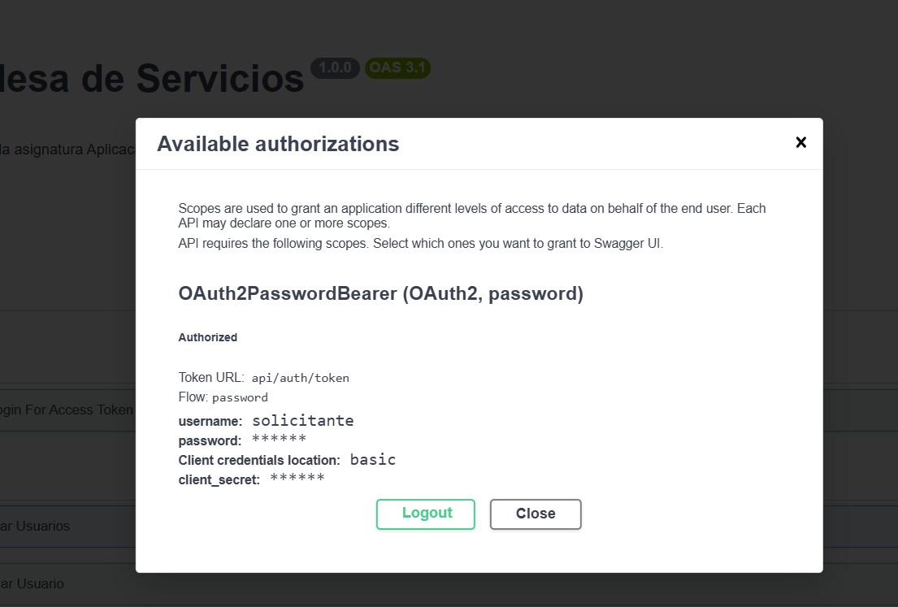
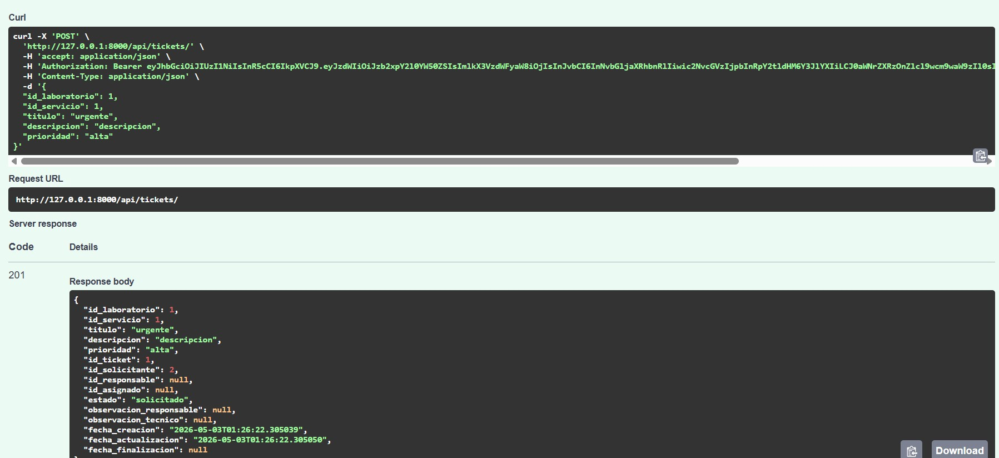
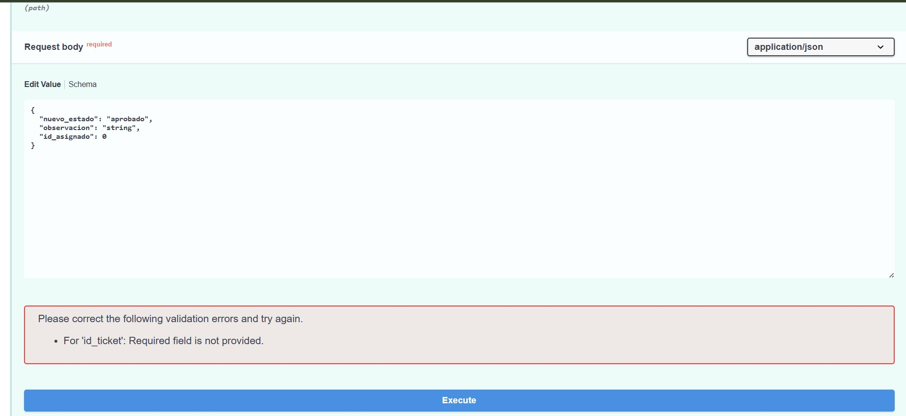

# Taller 3: API Mesa de Servicios para Laboratorios

## 1. Información General
* **Proyecto:** Sistema de gestión de tickets de servicios en laboratorios universitarios.
* **Asignatura:** Aplicaciones y Servicios Web
* **Fecha:** 2 de Mayo de 2026
* **Integrantes del Equipo:**
  * Diego Alejandro Giraldo Bolivar
  * Julian David Velez Arango
  * Jorge Andres Vidal Ramirez

## 2. Descripción del Sistema
API RESTful desarrollada con FastAPI para gestionar el ciclo de vida de los tickets de soporte técnico en los laboratorios de la universidad. El sistema implementa autenticación mediante JWT y autorización basada en *scopes* para controlar el acceso según cinco roles distintos (solicitante, responsable_tecnico, auxiliar, tecnico_especializado, admin). 

Se controlan estrictamente las transiciones de estado de los tickets y se valida la propiedad de los mismos para garantizar que solo el personal autorizado pueda atender o finalizar una solicitud.

**Entidades Implementadas:**
* **Usuarios:** Gestión de credenciales, roles y estado de actividad.
* **Laboratorios:** Catálogo de espacios físicos.
* **Servicios:** Tipos de soporte técnico ofrecidos.
* **Tickets:** Eje central del sistema que relaciona usuarios, laboratorios y servicios bajo un flujo de estados controlado.

## Pruebas

  Se crea usuarios para validar flujo:

  
  

  

  Lista de usuarios creados con los diferentes roles:

  

  Nos logueamos con el usuario solicitante:

  

  Se crea ticket con el usuario con el rol de solicitante:

  

  No se permite que el solicitante cambie los estados de la solicitud:

  

## Conclusiones
* **Principales Aprendizajes:** 
  Comprendimos cómo aislar la lógica de seguridad usando el sistema de dependencias de FastAPI (`Depends` y `Security`). Aprendimos que el botón "Authorize" de Swagger implementa el flujo OAuth2 enviando las credenciales como formulario (`x-www-form-urlencoded`) y cómo el token generado se inyecta automáticamente en las cabeceras HTTP (`Authorization: Bearer`) de las peticiones subsecuentes.

* **Dificultades Encontradas:** 
  1. **Aislamiento de Base de Datos:** Garantizar que los modelos de SQLAlchemy apuntaran exclusivamente al esquema `jwt_grupo_3` y no al `public` por defecto.
  2. **Incompatibilidad de Librerías de Hashing:** Al intentar utilizar `passlib`, nos enfrentamos a un conflicto interno de la librería con las versiones recientes de `bcrypt`, el cual generaba un error de límite de 72 bytes al intentar validar contraseñas debido a un bug de prueba interno de `passlib`.

* **Soluciones Aplicadas:** 
  1. **Esquema explícito:** Aplicamos el parámetro `__table_args__ = {"schema": "jwt_grupo_3"}` en cada clase de SQLAlchemy para forzar el mapeo estricto al esquema asignado.
  2. **Bypass de Passlib:** Ante la falta de mantenimiento de `passlib`, decidimos implementar el hashing seguro invocando directamente la librería oficial `bcrypt` (`bcrypt.gensalt()` y `bcrypt.hashpw()`), cumpliendo con el estándar de seguridad exigido de una forma más moderna, directa y libre de bugs.
